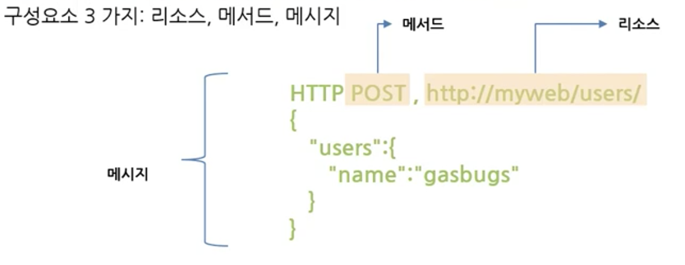

# Elasticsearch CRUD

## 1. 클러스터 탐색

- `REST API`
  - 노드와 통신하는 방법

  - Elasticsearch는 클러스터와 상호 작용하는 데 사용할 수 있는 매우 포괄적이고 강력한 REST API를 제공

  - API로 수행할 수 있는 몇가지 작업

    - 클러스터, 노드 및 색인 상태, 상태 및 통계 확인

    - 클러스터, 노드 및 색인 데이터 및 메타 데이터 관리

    - CRUD 및 인덱스에 대한 검색 작업 수행

    - 페이징, 정렬, 필터링, 스크립팅, 집계 및 기타 여러 고급 검색 작업 실행

      




## 2. 클러스터 상태 (Health)

```java
GET /_cat/nodes?v
```

- 녹색 - 모든 것이 좋음
- 노란색 - 모든 데이터를 사용할 수 있지만 일부 복제본은 아직 할당되지 않음 (클러스터는 완전히 작동)
- 빨간색 - 어떤 이유로든 일부 데이터를 사용할 수 없음 (클러스터 부분적으로 작동)


## 3. DB가 가진 데이터 확인하기

```java
GET/_cat/indices?v
```

- 갖고 있는 모든 인덱스 항목 조회
- Index는 일반 RDB에서의 데이터베이스의 역할


## 4. Elasitcsearch CRUD

### 1. Http 메서드와 CRUD, SQL 비교

| Http 메서드 |  CRUD  |  SQL   |
| :---------: | :----: | :----: |
|     GET     |  Read  | Select |
|     PUT     | Create | Insert |
|    POST     | Update | Update |
|   DELETE    | Delete | Delete |

### 2. 엘라스틱서치 데이터 처리

- 엘라스틱서치의 데이터 구조
  - 인덱스, 타입, 도큐먼트의 단위를 가짐
  - 도큐먼트는 엘라스틱서치의 데이터가 저장되는 최소 단위
  - 여러개의 도큐먼트는 하나의 타입
  - 다시 여러개의 타입은 하나의 인덱스로 구성

| RDBMS                   | Elasticsearch  |
| ----------------------- | -------------- |
| 데이터베이스 (Database) | 인덱스 (Index) |
| 테이블 (Table)          | 타입 (Type)    |
| 열 (Row)                | 필드 (Field)   |
| 스키마                  | 매핑 (Mapping) |


### 3. 데이터 입력 (PUT)

- age : 123 데이터를 put

```java
PUT customer/type1/1
{
  "doc":{
    "age" : 123"
  }
}
```

PUT <인덱스>/<도큐먼트 타입>/<도큐먼트 id>/_create


### 4. 데이터 수정 (POST)

- age를 123으로 변경

```java
POST customer/type1/1
{
  "doc":{
    "age" : 123"
  }
}
```

or

```java
POST customer/type1/1/_update
{
  "doc":{
    "age" : 123"
  }
}
```


- script의 cox.op 명령을 사용하여 필드 조건에 따라 도큐먼트 삭제

```java
POST customer/type1/1/_update
{
  "script":{
    "inline" : "if(ctx._source.age==123){ctx._source.age++}"
  }
}
```


### 5. 데이터 조회 (GET)

```java
GET customer/type1/1
```

- 내용은 _source 항목에 나타남


### 6. 데이터 삭제 (DELETE)

```java
DELETE customer/type1/1
```

```java
GET customer/type1/1
```

- 삭제된 인덱스를 조회할 시 `"acknowledged" : true` 응답만 리턴됨.
