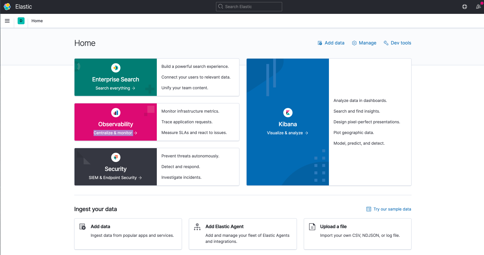

# Elasticsearch 개요

## 1. Elasitcsearch의 핵심 개념

- `클러스터 (Cluster)`
  - 전체 데이터를 함께 보유하고 모든 노드에서 연합 인덱싱 및 검색기능을 제공하는 하나 이상의 노드 (서버) 모음
  - 클러스터는 기본적으리 "elasticsearch"라는 고유한 이름으로 식별
  - 이 이름은 노드가 이름으로 클러스터에 참여하도록 설정된 경우 노드가 클러스터의 일부일 수 있기 때문에 중요함
- `노드 (Node)`
  - 노드는 클러스터의 일부이며 데이터를 저장하고 클러스터의 인덱싱 및 검색 기능에 참여하는 단일서버
     - 단일 클러스터에서 원하는 만큼의 노드를 소유가능
   - `색인 (Index)`
        - 색인은 다소 유사한 특성을 갖는 문서의 콜렉션
        - 색인은 이름 (소문자)로 식별되며 이 이름은 색인을 참조하는데 사용
   - `Type`
        - 사용자가 하나의 유형, 블로그 게시물을 다른 유형과 같이 여러 Type의 문서를 동일한 색인에 저장할 수 있도록 색인의 논리적 범주 / 파티션으로 사용되는 유형
        - 더이상 인덱스에 여러 유형을 작성할 수 없으며 이후 버전에서는 Type의 전체 개념이 제거됨
   - `Documents`
        - 문서는 색인을 생성 할 수 있는 기본 정보 단위
        - Json으로 표현


## 2. Elasticsearch + Cabana 다운로드 (Docker)

### 1. Elasticsearch 설치

- elasticsearch dock 이미지 가져오기

```dockerfile
docker pull docker.elastic.co/elasticsearch/elasticsearch:7.10.1
```


- 컨테이너 실행 

```dockerfile
docker run -d -p 9200:9200 -p 9300:9300 -e "discovery.type=single-node" docker.elastic.co/elasticsearch/elasticsearch:7.10.1
```


- 실행 컨테이너 확인

```dockerfile
docker ps
```


- localhost:9200

```html
{
  "name" : "e116f62da215",
  "cluster_name" : "docker-cluster",
  "cluster_uuid" : "uJjkurmoRH-nj1Q-RKdIjQ",
  "version" : {
    "number" : "7.10.1",
    "build_flavor" : "default",
    "build_type" : "docker",
    "build_hash" : "1c34507e66d7db1211f66f3513706fdf548736aa",
    "build_date" : "2020-12-05T01:00:33.671820Z",
    "build_snapshot" : false,
    "lucene_version" : "8.7.0",
    "minimum_wire_compatibility_version" : "6.8.0",
    "minimum_index_compatibility_version" : "6.0.0-beta1"
  },
  "tagline" : "You Know, for Search"
}
```


### 2. kibana 설치

- Kibana docker 이미지 가져오기

```dockerfile
docker pull docker.elastic.co/kibana/kibana:7.10.1
```


- 컨테이너 실행 - elasticsearch 참조

```dockerfile
docker run -d --link e116f62da215:elasticsearch -p 5601:5601 docker.elastic.co/kibana/kibana:7.10.1
```


- 컨테이너 확인

```dockerfile
docker ps
```


- localhost:5601



