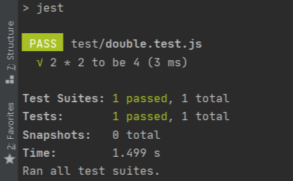

# Jest 개요

#### **Jest 란?** 

- 자바스크립트기반 테스트 프레임워크이이다. 
- Jest 이전에는 여러 테스트 라이브러리를 섞어서 사용했다고 한다.
- Mock 함수를 만들기 위해 Sinon과 Testdouble 같은 Test Mock 라이브러리를 추가로 설치하여 사용되었지만 **Jest를 사용하면 모든 기능을 한번에 쓸 수 있다.**


#### **Jest 설치하기** 

```bash
npm install --save-dev jest
```

 

#### **준비**

- 먼저 테스트 할 자바스크립트의 함수를 모듈로 export 한다.
```javascript
function double(number) {
    return number * 2;
}

module.exports = double;
```
- 테스트를 위한 파일을 하나 만들고, 방금 export 했던 모듈을 import 하여 테스트한다
```javascript
const double = require('../main/double');

test('2 * 2 to be 4', () => {
    expect(double(2)).toBe(4);
});
```

- 마지막으로 `package.json`에서 `"script"{"test"}`에 jest를 입력해주면 테스트 준비가 끝난다.
```javascript
{
  "scripts": {
    "test": "jest"
  }
}
```



