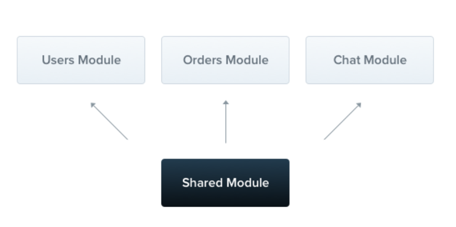

# NestJS Module

#### **NestJS 모듈이란?**
- 모듈은 @Module() 데코레이터로 주석이 달린 클래스이다. @Module() 데코레이터는 Nest가 애플리케이션 구조를 구성하는 데 사용하는 메타데이터를 제공한다. 각 응용 프로그램에는 하나 이상의 모듈이 있다. 모듈은 밀접하게 관련된 기능 집합으로 구성요소를 구성하는 효과적인 방법이다. 같은 기능에 해당하는 것들은 하나의 모듈 폴더안에 넣어서 관리한다.
- ex) BoardController, BoardService, BoardEntity은 BoardModule 안에 넣는다.


출처 :  NestJS


#### Board Module 생성하기
Board 모듈 생성 명령어
- 아래와 같은 명령어를 터미널에 입력한다.
```bash
nest g module boards
```

방금 생성된 boardModule을 사용하기 위해서는 루트 모듈인 app.module.ts 에 등록해주어야 한다.
-> board 모듈을 생성할때 자동으로 등록되기 때문에 신경 안써도 된다.

```typescript
// board.module.ts
import { Module } from '@nestjs/common';
import { BoardsModule } from './boards/boards.module';

@Module({
    imports: [BoardsModule]
})
export class AppModule {}
```


