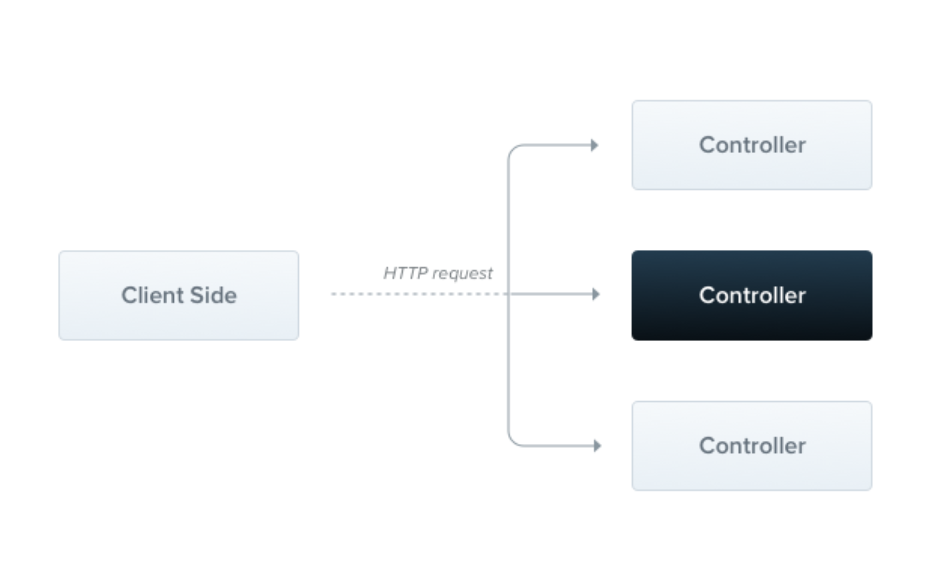

# NestJS Module

#### **NestJS 컨트롤러란?**
- 컨트롤러는 들어오는 요청을 처리하고 클라이언트에 응답을 반환하는 역할을 뜻한다.
(스프링이랑 구조가 굉장히 비슷하다)



출처 :  NestJS


#### Board Controller 생성하기
- 컨트롤러는 @Controller 데코레이터로 클래스를 데코레이션하여 정의한다.
- @Get, @Post, @Delete 같은 메소드들은 **핸들러** 라고 한다.
```typescript
@Controller('/boards')
export class BoardsController {
  
  @Get()
  getBoards(): string {
    return 'This action returns all boards';
  }
}
```

#### Boards Controller 생성하기
- 터미널에 아래의 명령어를 입력하면 controller가 생성된다.

```typescript
import { Controller } from '@nestjs/common';

@Controller('boards')
export class BoardsController {}
```


