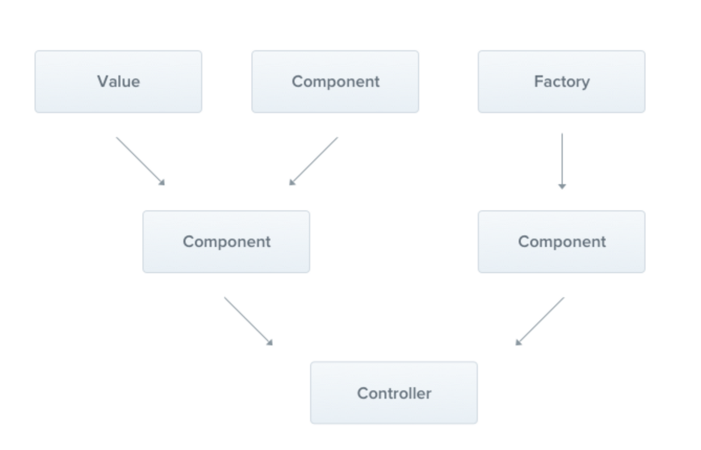

# NestJS Provider

#### **NestJS Provider 란?**
- provider는 Nest의 기본 개념이다. 대부분의 Nest 클래스는 서비스, 레파지토리, 팩토리, 헬퍼 등 provider로 취급될 수 있다. provider 의 주요 아이디어는 종속성으로 주입할 수 있다는 것이다. 즉, 객체는 서로 다양한 관계를 만들 수 있으며, 객체의 인스턴스를 연결하는 기능은 대부분 Nest 런타임 시스템에 위임될 수 있다.



출처 :  NestJS


#### Provider 등록하기
- provider를 사용하기 위해서는 Nest에 등록을 해야 사용가능하다. 등록하기 위해서는 module 파일에 아래코드와 같이 해당 모듈에서 사용하고자 하는 provider 를 넣으면 된다.

```typescript
// board.module.ts
@Controller('/boards')
export class BoardsController {
  
  @Get()
  getBoards(): string {
    return 'This action returns all boards';
  }
}
```


