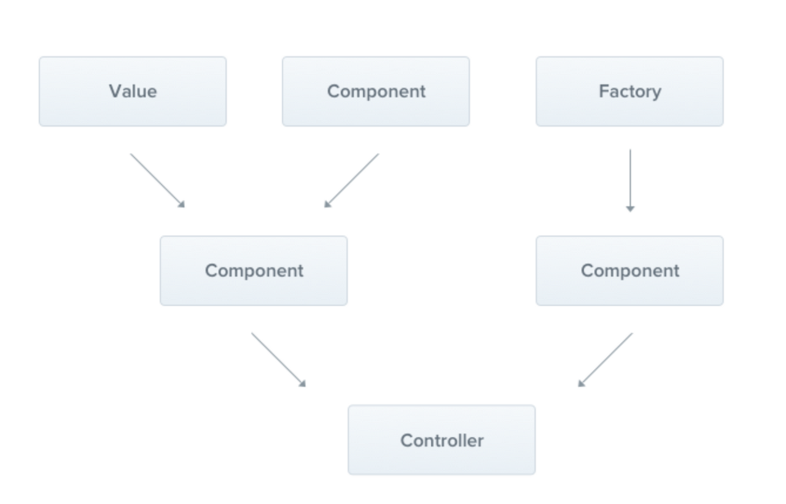

# NestJS Service

#### **NestJS Service 란?**
- service는 소프트웨어 개발내의 공통 개념이며 (spring을 생각하면 편하다.) NestJS, Nodejs에서만 쓰이는 개념이 아니다. @Injectable 데코레이터로 감싸져서 모듈에 제공되며, 이 서비스 인스턴스는 어플리케이션 전체에서 사용 될 수 있다. service 는 컨트롤러에서 데이터의 유효성체크를 하거나 데이터베이스에 아이템을 생성하는 등의 작업하는 부분을 처리한다.


출처 :  NestJS


#### Boards Service 만들기
- 아래의 명령어를 입력하면 BoardsService가 생성된다.

```bash
nest g service boards --no--spec
```
```typescript
// board.service.ts
import { Injectable } from '@nestjs/common';

@Injectable()
export class BoardsService {}
```

- service 를 생성하였다면 controller 에서 이용할수 있게 바꿔주어야 한다.
- BoardsController 클래스 안에서 사용하기 위해서 this.boardsService 프로퍼티에 boardsService 파라미터를 할당해준다. 하지만 Typescript 에서는 선언한 값만 객체의 프로퍼티로 사용가능하기 때문에 boardsService: BoaredsService로 선언해준다.

```typescript
// boards.controller.ts
@Controller('/boards')
export class BoardsController {
    boardsService: BoardsService;

    constructort( private boardsService: BoardsService) {}

    @Get()
    getBoards(): string {
        return 'This action returns all boards';
    }
}
```
